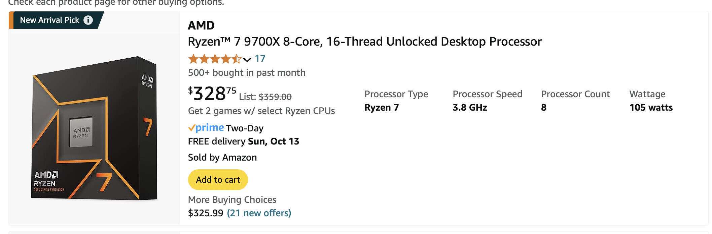

# This is Jeff's awesome website

This is a web about sicence.

Sometimes I use [Google](https://www.google.com) to do research.

This is my CPU.

This is an embedded html sentence:

 

If want to learn more, visit [this page](about.html)

